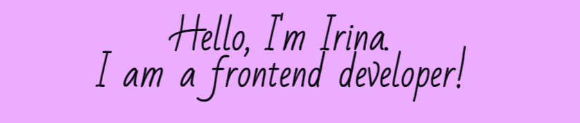

### A little bit about me

In 2023, I became interested in website development. She took courses in web design at the university, where she mastered the basics of CSS and html. After the courses, I made up websites for friends and acquaintances on my own. I wanted to move on, and then I decided that I wanted to be a frontend developer. So I started studying Javascript at the Hexlet School of Programming from 2023-2025

* 🌍  I'm based in Nizhniy Novgorod
* ✉️  You can contact me at [irina92-08@mail.ru](mailto:irina92-08@mail.ru)
* ⚡  My education: 2010-2016 - Information Management, Alekseev Nizhny Novgorod State University
<!--
**irina92-08/irina92-08** is a ✨ _special_ ✨ repository because its `README.md` (this file) appears on your GitHub profile.

Here are some ideas to get you started:

- 🔭 I’m currently working on ...
- 🌱 I’m currently learning ...
- 👯 I’m looking to collaborate on ...
- 🤔 I’m looking for help with ...
- 💬 Ask me about ...
- 📫 How to reach me: ...
- 😄 Pronouns: ...
- ⚡ Fun fact: ...
-->
